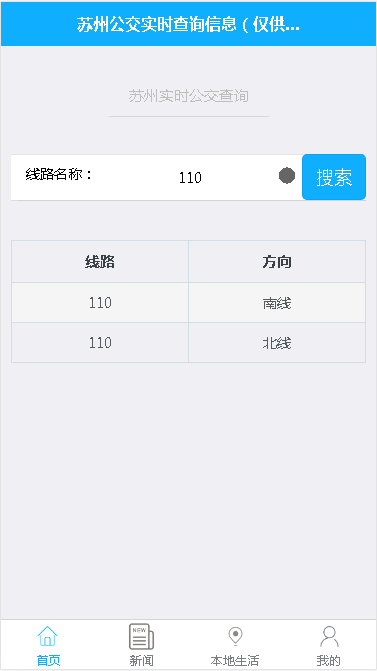
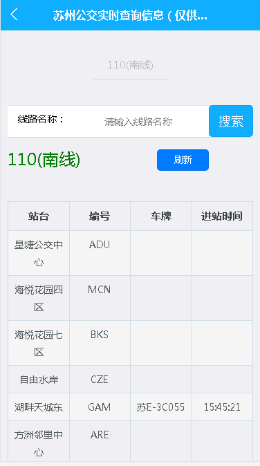
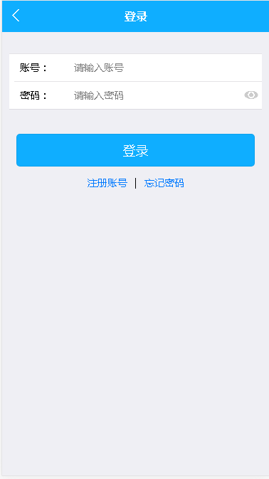
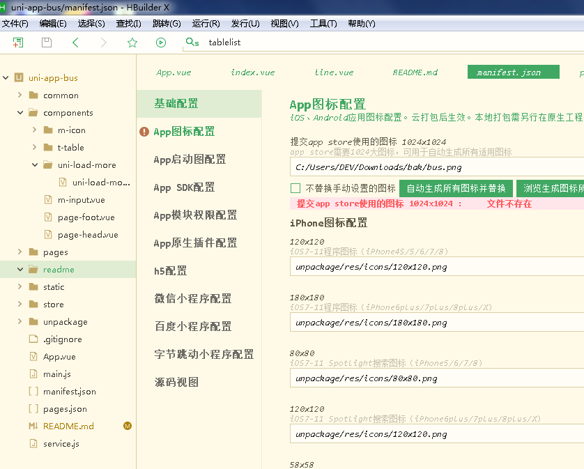
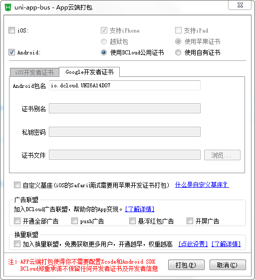

## uni-app 实时公交查询 APP

### 一、项目预览

#### 1. 首页线路搜索


#### 2. 线路详情页


#### 3. 新闻页列表页


#### 4. 登录页面


### 二、使用方法

#### 1. 下载 Hbuilder X 


#### 2. 导入项目

- 下载项目
```
git clone https://gitee.com/lisgroup/uni-app-bus
```
- 打开 Hbuilder X
- 按照以下顺序： 文件(F) > 导入(C) > 从本地目录导入(D)...

#### 3. 打包文件

按照以下顺序： 发布(U) > 原生App-云打包(P)


